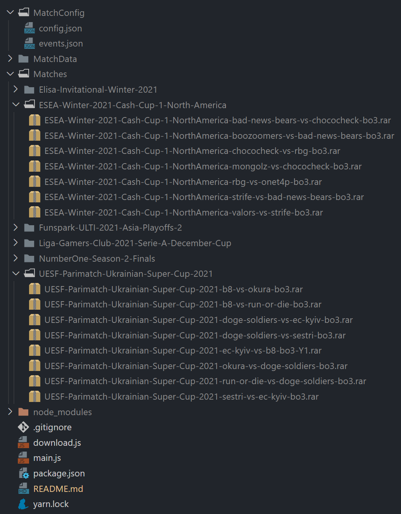

# CSGO Demo Batch

批量获取CSGO比赛信息和下载demo，支持断点续传

## 确认网络状况和存储

在下载的机器上使用如下命令测试下载录像的速度，避免下载速度过慢，一般会被限制在 1MB/s 附近

```bash
wget --content-disposition https://www.hltv.org/download/demo/69528
```

半年的录像大概有2500个，预计不超过 700GB，请留足剩余空间

## 环境准备

安装 nodejs 和 yarn 可以用包管理器或在官网下载安装程序

```bash
# centos
yum install nodejs

# ubuntu
apt install nodejs

# windows scoop 包管理
scoop install nodejs
...
```

安装yarn

```bash
npm install -g yarn
```

确认环境正常

```bash
node -v
yarn -v
```

## 调整设置

下载源代码 https://github.com/Purple-CSGO/CSGO-Demo-Batch/archive/refs/heads/master.zip

打开 `main.js`，修改 `config` 的数值

- target_dir: 录像下载目录
- start: 起始的比赛id
- end: 结束的比赛id
- note: 说明，方便区分下载的内容范围

### 比赛id的寻找

比如想要下载2021年1月~3月的比赛录像，打开 https://www.hltv.org/results 限定时间范围，找到第一个和最后一个比赛结果，查看网址，示例：

```
https://www.hltv.org/matches/2353847/dng-vs-inde-irae-dell-gaming-academy-season-2
https://www.hltv.org/matches/2353853/team-shoke-vs-team-strogo-buster-all-star-haval-cup-2021
```

则可以设置成

```javascript
let config = {
  target_dir: "E:\\2021-1-to-3",
  start: "2353847",
  end: "2353853",
  current: "",
  matches: [],
  // events: [],
  note: "2021年 1月 ~ 3月"
}

```

> 仅示意

### 安装依赖

切换到项目根目录

```bash
yarn install
```

### 下载元数据

切换到项目根目录，使用如下命令，最好一次性完成

```bash
node ./main.js
```

### 下载录像

同样，不过注意下载的速度，最好挂在nas或者软路由等一直开机的设备上，中断的也没事，再次使用命令可以从中断位置继续下载

```bash
node ./download.js
```

### 设置文件夹同步

预计半年的录像下载要一周时间，如果不想全部下载完成后再上传，可以在网盘中设置自动同步的文件夹

### 多组配置注意事项

建议为每组下载的配置设置单独的文件夹，每次重新配置前务必删除 `./MatchConfig/config.json`

## 下载效果预览


